  

  <!-- Typing SVG -->
  

  
  
  
  
  
  
  
  
  

 

  
  &#8287;&#8287;&#8287;&#8287;&#8287;
  

 

## 🚀 Projetos em Destaque

### 🐎 VetEquine — SaaS de Gestão Veterinária Equina
Plataforma que centraliza prontuários, exames e rotina clínica de veterinários especializados em equinos. Usa transcrição automática de consultas via IA (Whisper STT) e um assistente com LLM para reduzir a documentação manual — hoje um dos maiores gargalos da rotina desses profissionais. Construído em **arquitetura de microsserviços** com **BFF Gateway**, isolando domínios (prontuários, agenda, IA) para escalar cada parte de forma independente.

`Node.js` `PostgreSQL` `Prisma` `Microsserviços` `BFF Gateway` `Whisper STT` `LLM`

### 🌱 Moo Tech — Pasto Inteligente *(Cofundador & CEO)*
Startup agtech de IoT para pecuária: sensores monitoram em tempo real as condições do pasto para orientar decisões de manejo, aumentando produtividade e sustentabilidade da atividade rural. Selecionada para o **Programa Centelha 3 Goiás (MCTI)**, um dos principais programas de fomento à inovação do país.

`IoT` `Agtech` `Hardware + Software`

### 🛒 TCC — Compras Coletivas para Regiões Periféricas
Plataforma full-stack que viabiliza compras coletivas e fomenta o empreendedorismo local em regiões periféricas, aproximando pequenos empreendedores de melhores condições de compra e de mais visibilidade no próprio bairro.

`Full-stack` `Impacto Social`

### 🎨 Landing Pages (Freelance)
Landing pages de alto impacto visual para clientes, com foco em performance e animações — HTML, Tailwind CSS e GSAP/ScrollTrigger.

 

## 📊 GitHub Stats

  
  

 

## 📬 Contato

  
  

